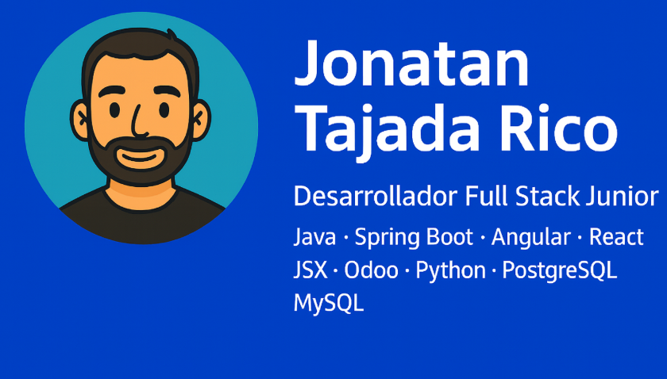

  

<h1 align="center">👋 Hola, soy Jonatan Tajada Rico</h1>

 💻 <strong>Desarrollador Full Stack Junior</strong> con formación en Desarrollo de Aplicaciones Multiplataforma (DAM).  
Manejo <strong>Java</strong> y <strong>Spring Boot</strong> para backend, <strong>Angular</strong> y <strong>React (JSX)</strong> para frontend,  
y he trabajado con <strong>Odoo (Python)</strong>, bases de datos <strong>PostgreSQL</strong> y <strong>MySQL</strong>, y automatización con <strong>Make</strong>.

Me apasiona <strong>crear aplicaciones web</strong>, <strong>automatizar procesos</strong> y <strong>trabajar con datos</strong>,  
siempre buscando soluciones útiles para las personas y las empresas.

---

## 🚀 Tecnologías y Herramientas

- **Backend:** Java · Spring Boot · APIs REST
- **Frontend:** Angular · React · TypeScript · JSX · TailwindCSS
- **Bases de datos:** PostgreSQL · MySQL
- **Otros:** Odoo · Python · Make · Git · GitHub
- **Metodologías:** MVC · DAO-Service · Arquitectura en capas

---

## 📈 Actualmente

- Ampliando conocimientos en **Spring Boot**, **Angular**, **React** y automatización.
- Próximo objetivo: **especializarme en Inteligencia Artificial y Big Data**.

---

## 🤝 Busco mi primera oportunidad

Estoy listo para incorporarme a un equipo donde pueda **aprender, aportar y crecer profesionalmente**.  
Si mi perfil encaja contigo o tu empresa, ¡me encantará hablar!

---

## 📫 Contacto

  
  
  

